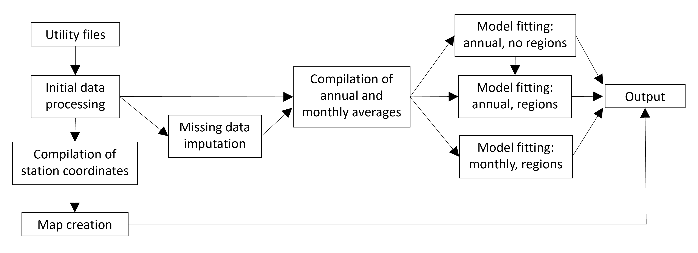

# Food web drivers in the San Francisco Estuary

This repository contains R code, data, and results supporting the project "Evaluating 
top-down, bottom-up, and environmental drivers of pelagic food web dynamics along an 
estuarine gradient" by Tanya L. Rogers, Samuel M. Bashevkin, Christina E. Burdi, 
Denise D. Colombano, Peter N. Dudley, Brian Mahardja, Lara Mitchell, Sarah Perry, and 
Parsa Saffarinia. A link to the accompanying article will be posted here when available.

## Overview

The project uses structural equation modeling and four decades of integrated data 
to investigate the relative effects of different drivers of the pelagic food web in the 
San Francisco Estuary. 

Project files are organized according to the following folder structure:
* data: scripts for accessing, processing, and saving data prior to model fitting
*	maps: script for creating a map of sampling stations in the San Francisco Estuary
*	analysis: scripts to carry out structural equation modeling
*	docs: html files produced as byproducts of data processing and model fitting
*	fig_output: figures, tables, Word documents, and RData files representing 
intermediate and final analysis results
*	functions, lib: utility scripts and libraries

The following diagram outlines the general project workflow. 

